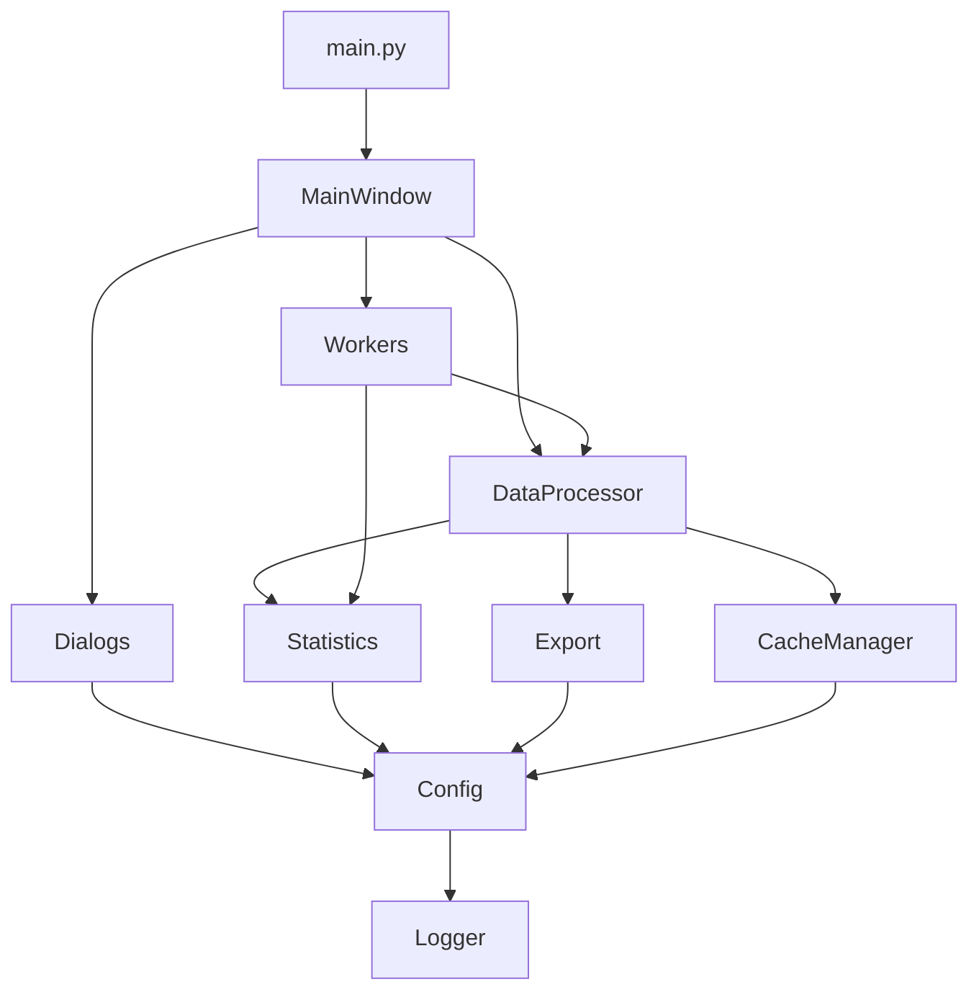

# AAT 設計仕様書

## 目次

1. [概要](#概要)
2. [システムアーキテクチャ](#システムアーキテクチャ)
3. [データフロー設計](#データフロー設計)
4. [アルゴリズム仕様](#アルゴリズム仕様)
5. [データ構造](#データ構造)
6. [インターフェース設計](#インターフェース設計)
7. [性能要件](#性能要件)
8. [セキュリティ設計](#セキュリティ設計)
9. [エラー処理設計](#エラー処理設計)
10. [拡張性と保守性](#拡張性と保守性)

---

## 概要

### システムの目的

AAT (Acceleration Analysis Tool) は、微小重力環境実験のデータを解析するための専用アプリケーションです。Inner CapsuleとDrag Shieldの加速度データから重力レベルを計算し、統計解析とG-quality評価を通じて、実験環境の品質を定量的に評価します。

### 主要な設計目標

1. **高精度なデータ処理**: 科学実験データの正確な解析
2. **高速処理**: 大容量データの効率的な処理
3. **使いやすさ**: 直感的なGUIによる操作性
4. **拡張性**: 新しい解析手法の追加が容易
5. **信頼性**: エラーハンドリングとデータ整合性の保証

---

## システムアーキテクチャ

### レイヤードアーキテクチャ

```
┌─────────────────────────────────────────────┐
│         Presentation Layer (GUI)             │
│  ┌─────────────┬──────────────┬──────────┐ │
│  │ MainWindow  │   Dialogs    │  Workers │ │
│  └─────────────┴──────────────┴──────────┘ │
├─────────────────────────────────────────────┤
│          Business Logic Layer                │
│  ┌──────────────┬──────────────┬─────────┐ │
│  │DataProcessor │  Statistics  │  Export │ │
│  └──────────────┴──────────────┴─────────┘ │
├─────────────────────────────────────────────┤
│         Infrastructure Layer                 │
│  ┌──────────┬──────────┬─────────────────┐ │
│  │  Config  │  Logger  │  CacheManager   │ │
│  └──────────┴──────────┴─────────────────┘ │
└─────────────────────────────────────────────┘
```

### コンポーネント間の依存関係



### モジュール設計

#### Core モジュール群

1. **data_processor.py**
   - 責務: CSVデータの読み込みと前処理
   - 主要機能: 列検出、同期点検出、重力レベル変換

2. **statistics.py**
   - 責務: 統計計算とG-quality解析
   - 主要機能: 最小標準偏差区間検出、範囲統計

3. **cache_manager.py**
   - 責務: 処理済みデータのキャッシュ管理
   - 主要機能: キャッシュ生成、検証、削除

4. **export.py**
   - 責務: 結果のエクスポート
   - 主要機能: Excel出力、グラフ保存

5. **config.py**
   - 責務: 設定管理
   - 主要機能: 設定の読み込み、保存、デフォルト値管理

6. **logger.py**
   - 責務: ロギング
   - 主要機能: モジュール別ログ、例外ログ

7. **exceptions.py**
   - 責務: カスタム例外定義
   - 主要機能: 階層的例外クラス

#### GUI モジュール群

1. **main_window.py**
   - 責務: メインウィンドウとグラフ表示
   - 主要機能: UI管理、イベント処理、グラフ描画

2. **workers.py**
   - 責務: バックグラウンド処理
   - 主要機能: 非同期データ処理、進捗報告

3. **settings_dialog.py**
   - 責務: 設定UI
   - 主要機能: 設定値の表示、編集、保存

4. **column_selector_dialog.py**
    - 責務: 列選択UI
    - 主要機能: CSV列の選択、プレビュー

5. **styles.py**
    - 責務: テーマとスタイル管理
    - 主要機能: カラーパレット定義、テーマ適用、スタイルシート生成

---

## データフロー設計

### メインデータ処理フロー

```
[CSVファイル]
    ↓
[列検出・選択]
    ↓
[データ読み込み]
    ↓
[同期点検出] ←─── [設定: acceleration_threshold]
    ↓
[時間軸調整]
    ↓
[重力レベル変換] ←─ [設定: gravity_constant]
    ↓
[データフィルタリング] ← [設定: end_gravity_level]
    ↓
[統計計算] ←─── [設定: window_size]
    ↓
[結果表示・エクスポート]
```

### キャッシュフロー

```
[ファイルパス + 設定] → [ハッシュ生成]
                            ↓
                    [キャッシュ確認]
                    ↙          ↘
            [キャッシュあり]  [キャッシュなし]
                ↓                ↓
        [キャッシュ読込]    [データ処理]
                ↓                ↓
            [データ返却]    [キャッシュ保存]
                                ↓
                            [データ返却]
```

### G-quality解析フロー

```
[フィルタ済みデータ]
    ↓
[ウィンドウサイズ初期化] ← [設定: g_quality_start]
    ↓
[ループ開始]
    ↓
[統計計算（現在のウィンドウ）]
    ↓
[結果記録]
    ↓
[ウィンドウサイズ増加] ← [設定: g_quality_step]
    ↓
[終了判定] ← [設定: g_quality_end]
    ↓
[結果集計・グラフ生成]
```

---

## アルゴリズム仕様

### 同期点検出アルゴリズム

```python
def detect_sync_point(acceleration_data, threshold):
    """
    加速度データから同期点を検出
    
    1. 加速度の絶対値が閾値を超える最初の点を検出
    2. ノイズ除去のため、連続する複数点での確認
    3. 検出失敗時は例外を発生
    """
    for i in range(len(acceleration_data)):
        if abs(acceleration_data[i]) > threshold:
            # 連続性チェック（ノイズ除去）
            if i + 2 < len(acceleration_data):
                if (abs(acceleration_data[i+1]) > threshold * 0.8 and
                    abs(acceleration_data[i+2]) > threshold * 0.8):
                    return i
    raise SyncPointNotFoundError()
```

### 重力レベル変換式

```
gravity_level (μG) = (acceleration / gravity_constant) × 10^6

ここで:
- acceleration: 加速度データ (m/s²)
- gravity_constant: 基準重力加速度 (デフォルト: 9.797578 m/s²)
```

### 最小標準偏差区間検出アルゴリズム

```python
def find_min_std_window(data, window_size, sampling_rate):
    """
    スライディングウィンドウで最小標準偏差区間を検出
    
    1. ウィンドウサイズをサンプル数に変換
    2. 全データをスライディングウィンドウで走査
    3. 各ウィンドウの標準偏差を計算
    4. 最小標準偏差を持つウィンドウを特定
    5. 該当区間の統計情報を返却
    """
    window_samples = int(window_size * sampling_rate)
    min_std = float('inf')
    best_window_start = 0
    
    for i in range(len(data) - window_samples + 1):
        window_data = data[i:i + window_samples]
        std = np.std(window_data)
        if std < min_std:
            min_std = std
            best_window_start = i
    
    return {
        'start_time': best_window_start / sampling_rate,
        'min_std': min_std,
        'mean_abs': np.mean(np.abs(window_data))
    }
```

---

## データ構造

### 主要なデータ構造

#### 処理済みデータ辞書
```python
processed_data = {
    'time': pd.Series,                    # 時間データ（秒）
    'gravity_level_inner_capsule': pd.Series,  # IC重力レベル（μG）
    'gravity_level_drag_shield': pd.Series,    # DS重力レベル（μG）
    'adjusted_time': pd.Series,           # 調整済み時間（秒）
    'acceleration_inner_capsule': pd.Series,   # IC加速度（m/s²）
    'acceleration_drag_shield': pd.Series,     # DS加速度（m/s²）
    'sync_point': int,                    # 同期点インデックス
    'end_index': int,                     # 終了点インデックス
    'statistics': {
        'inner_capsule': {
            'mean_abs': float,
            'start_time': float,
            'min_std': float
        },
        'drag_shield': {
            'mean_abs': float,
            'start_time': float,
            'min_std': float
        }
    }
}
```

#### G-quality結果構造
```python
g_quality_result = {
    'window_sizes': List[float],          # ウィンドウサイズリスト
    'inner_capsule': {
        'min_stds': List[float],          # 各ウィンドウの最小標準偏差
        'start_times': List[float],       # 各ウィンドウの開始時間
        'mean_abs': List[float]           # 各ウィンドウの絶対値平均
    },
    'drag_shield': {
        'min_stds': List[float],
        'start_times': List[float],
        'mean_abs': List[float]
    }
}
```

#### 設定データ構造
```python
config = {
    # データ処理設定
    'time_column': str,
    'acceleration_column_inner_capsule': str,
    'acceleration_column_drag_shield': str,
    'sampling_rate': int,                 # Hz
    'gravity_constant': float,            # m/s²
    
    # 同期・フィルタ設定
    'acceleration_threshold': float,      # m/s²
    'end_gravity_level': float,          # μG
    'min_seconds_after_start': float,    # 秒
    
    # 統計設定
    'window_size': float,                # 秒
    
    # G-quality設定
    'g_quality_start': float,            # 秒
    'g_quality_end': float,              # 秒
    'g_quality_step': float,             # 秒
    'auto_calculate_g_quality': bool,
    
    # 表示設定
    'ylim_min': float,                   # μG
    'ylim_max': float,                   # μG
    
    # システム設定
    'use_cache': bool,
    'app_version': str
}
```

---

## インターフェース設計

### PySide6 Signalインターフェース

#### MainWindow Signals
```python
class MainWindow(QMainWindow):
    # ファイル処理関連
    file_loaded = Signal(str)          # ファイル読み込み完了
    file_error = Signal(str)           # ファイルエラー
    
    # 処理進捗
    progress_started = Signal(str)     # 処理開始
    progress_updated = Signal(int)     # 進捗更新（0-100）
    progress_finished = Signal()       # 処理完了
    
    # データ更新
    data_updated = Signal(dict)        # データ更新
    statistics_updated = Signal(dict)  # 統計更新
```

#### Worker Signals
```python
class GQualityWorker(QThread):
    # 進捗報告
    progress = Signal(int)             # 進捗率
    status = Signal(str)               # ステータスメッセージ
    
    # 結果報告
    result = Signal(dict)              # 解析結果
    error = Signal(str)                # エラーメッセージ
    finished = Signal()                # 処理完了
```

### ファイルインターフェース

#### CSVファイル形式
```csv
時間(s),Z-axis acceleration 1(m/s²),Z-axis acceleration 2(m/s²)
0.000,0.0012,-0.0008
0.001,0.0015,-0.0010
...
```

#### Excelファイル構造
```
Workbook/
├── Gravity Level Data/         # 時系列データ
│   ├── Time (s)
│   ├── Inner Capsule (μG)
│   ├── Drag Shield (μG)
│   └── Adjusted Time (s)
├── Gravity Level Statistics/   # 統計サマリー
│   ├── Dataset
│   ├── Mean Abs (μG)
│   ├── Start Time (s)
│   └── Min Std (μG)
├── Acceleration Data/          # 元データ
│   ├── Time (s)
│   ├── Inner Capsule (m/s²)
│   └── Drag Shield (m/s²)
└── G-quality Analysis/         # G-quality結果
    ├── Window Size (s)
    ├── IC Min Std (μG)
    └── DS Min Std (μG)
```

---

## 性能要件

### 応答時間要件

| 操作 | 目標応答時間 | 最大許容時間 |
|------|-------------|-------------|
| ファイル選択ダイアログ | < 100ms | 500ms |
| 小規模ファイル処理（< 10MB） | < 1秒 | 3秒 |
| 中規模ファイル処理（< 100MB） | < 5秒 | 10秒 |
| 大規模ファイル処理（< 1GB） | < 30秒 | 60秒 |
| グラフ描画 | < 200ms | 500ms |
| 範囲選択統計 | < 50ms | 200ms |
| G-quality解析 | < 10秒 | 30秒 |

### メモリ使用量

| データサイズ | 想定メモリ使用量 | 最大許容量 |
|-------------|----------------|-----------|
| 10MB CSV | < 100MB | 200MB |
| 100MB CSV | < 500MB | 1GB |
| 1GB CSV | < 2GB | 4GB |

### 並行処理要件

- UIスレッドのブロッキング時間: 最大50ms
- バックグラウンドワーカー数: 最大4スレッド
- キャッシュアクセス: 排他制御により整合性保証

---

## セキュリティ設計

### ファイルアクセス制御

1. **入力検証**
   - ファイルパスのサニタイゼーション
   - 拡張子チェック（.csv, .CSV のみ許可）
   - ファイルサイズ制限（デフォルト: 2GB）

2. **権限管理**
   - 読み取り専用でファイルを開く
   - システムディレクトリへの書き込み禁止
   - ユーザーディレクトリ外へのアクセス制限

### データ保護

1. **機密情報の取り扱い**
   - 設定ファイルにパスワードを保存しない
   - ログに機密情報を出力しない
   - キャッシュファイルの暗号化（将来実装）

2. **データ整合性**
   - キャッシュファイルのチェックサム検証
   - バージョン不整合の検出
   - 破損データの自動削除

---

## エラー処理設計

### エラー分類と処理方針

#### 回復可能エラー
```python
try:
    # ファイル処理
except ColumnNotFoundError:
    # 列選択ダイアログを表示
    self.show_column_selector()
except SyncPointNotFoundError:
    # 設定調整を促す
    self.suggest_threshold_adjustment()
```

#### 回復不可能エラー
```python
try:
    # クリティカルな処理
except MemoryError:
    # エラーログ記録
    logger.critical("メモリ不足")
    # アプリケーション終了
    QMessageBox.critical(self, "致命的エラー", "メモリが不足しています")
    sys.exit(1)
```

### エラーメッセージ設計

1. **ユーザー向けメッセージ**
   - 日本語で明確に
   - 対処法を含める
   - 技術的詳細は含めない

2. **ログメッセージ**
   - 英語で記述
   - スタックトレース含む
   - デバッグ情報を詳細に

---

## 拡張性と保守性

### プラグインアーキテクチャ（将来構想）

```python
class AnalysisPlugin(ABC):
    """解析プラグインの基底クラス"""
    
    @abstractmethod
    def name(self) -> str:
        """プラグイン名"""
        pass
    
    @abstractmethod
    def analyze(self, data: pd.DataFrame) -> dict:
        """解析実行"""
        pass
    
    @abstractmethod
    def visualize(self, results: dict) -> QWidget:
        """結果の可視化"""
        pass
```

### 設定の拡張性

- JSON形式による柔軟な設定
- スキーマバージョニング
- 後方互換性の維持
- デフォルト値の自動適用

### コードの保守性

1. **モジュール性**
   - 単一責任の原則
   - 疎結合な設計
   - 明確なインターフェース

2. **テスタビリティ**
   - 依存性注入
   - モック可能な設計
   - 純粋関数の使用

3. **ドキュメント**
   - 包括的なdocstring
   - 型ヒントの完備
   - 設計決定の記録

---

最終更新日: 2025年11月22日