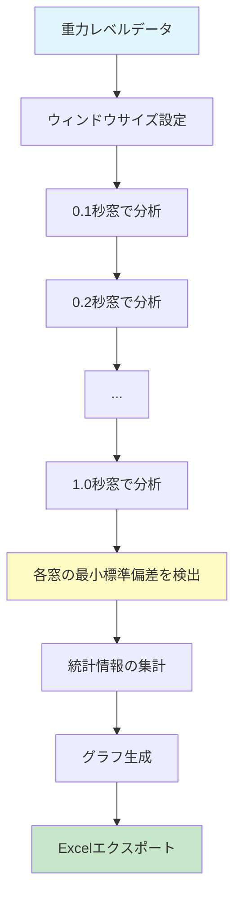

# G-quality評価 - G-quality Evaluation

このページでは、AATの核心機能である**G-quality評価**について詳しく説明します。

---

## 🔬 G-quality評価とは

**G-quality（重力品質）評価**は、微小重力環境の品質を定量的に評価するための分析手法です。異なる時間窓（ウィンドウサイズ）で重力レベルデータを分析し、最も安定した微小重力環境を特定します。

### 評価の目的

- 微小重力実験の品質管理
- 最適な実験時間帯の特定
- 実験条件の定量的評価
- 論文や報告書用のデータ生成

---

## 📊 評価アルゴリズム

### 基本原理

複数のウィンドウサイズ（時間窓）で標準偏差が最小となる区間を検出します。

### 処理フロー



### ウィンドウサイズ

AATは以下の10段階のウィンドウサイズで分析を実行します:

| ウィンドウサイズ | サンプル数 (1000Hz) |
|----------------|-------------------|
| 0.1秒 | 100サンプル |
| 0.2秒 | 200サンプル |
| 0.3秒 | 300サンプル |
| 0.4秒 | 400サンプル |
| 0.5秒 | 500サンプル |
| 0.6秒 | 600サンプル |
| 0.7秒 | 700サンプル |
| 0.8秒 | 800サンプル |
| 0.9秒 | 900サンプル |
| 1.0秒 | 1000サンプル |

---

## 🎯 評価指標

### 各ウィンドウサイズで計算される指標

1. **平均重力レベル（Average G-level）**
   - 最小標準偏差ウィンドウ内の絶対値の平均
   - 微小重力環境の代表値

2. **開始時間（Start Time）**
   - 最小標準偏差ウィンドウの開始時刻
   - 最適な実験タイミングの特定

3. **標準偏差（Standard Deviation）**
   - 最小標準偏差の値
   - 重力レベルの安定性の指標

### 評価基準

一般的に、以下のような基準で評価されます:

| 標準偏差 | 品質評価 |
|---------|---------|
| < 0.001 G | 非常に良好 |
| 0.001 - 0.005 G | 良好 |
| 0.005 - 0.01 G | 許容範囲 |
| > 0.01 G | 要改善 |

※評価基準は実験の要求精度によって異なります

---

## 🖥️ G-quality評価の実行方法

### 方法1: 自動実行（推奨）

設定ダイアログで「G-quality自動計算」を有効にすると、CSVファイル読み込み時に自動的に評価が実行されます。

### 方法2: 手動実行

1. CSVファイルを読み込む
2. 「**G-quality評価モード**」ボタンをクリック
3. 進捗バーで処理状況を確認
4. 完了後、結果がグラフとExcelに保存されます

### 処理時間

- データサイズによりますが、通常は数秒〜数十秒で完了
- バックグラウンド処理のため、UIは操作可能

---

## 📈 結果の解釈

### グラフの見方

G-quality評価グラフには以下の3つのサブプロットが表示されます:

#### 1. 平均重力レベル vs ウィンドウサイズ

- **X軸**: ウィンドウサイズ（秒）
- **Y軸**: 平均重力レベル（G）
- **解釈**: ウィンドウサイズによる重力レベルの変化を確認

#### 2. 開始時間 vs ウィンドウサイズ

- **X軸**: ウィンドウサイズ（秒）
- **Y軸**: 開始時間（秒）
- **解釈**: 最適な時間窓がどの時刻から始まるかを確認

#### 3. 標準偏差 vs ウィンドウサイズ

- **X軸**: ウィンドウサイズ（秒）
- **Y軸**: 標準偏差（G）
- **解釈**: ウィンドウサイズによる安定性の変化を確認

### Excelファイルの内容

生成されたExcelファイルの「G-quality Analysis」シートには、以下の情報が含まれます:

| 列名 | 説明 |
|------|------|
| Window Size (s) | ウィンドウサイズ |
| Inner Average G | Inner Capsuleの平均重力レベル |
| Inner Start Time (s) | Inner Capsuleの開始時間 |
| Inner Std Dev | Inner Capsuleの標準偏差 |
| Drag Average G | Drag Shieldの平均重力レベル |
| Drag Start Time (s) | Drag Shieldの開始時間 |
| Drag Std Dev | Drag Shieldの標準偏差 |

---

## 💡 使用例とベストプラクティス

### 例1: 落下塔実験の評価

```
目的: 3秒間の落下実験で最も安定した微小重力環境を特定

手順:
1. 落下実験のCSVデータを読み込み
2. G-quality評価を実行
3. 標準偏差が最小のウィンドウサイズを確認
4. そのウィンドウの開始時間を記録

結果例:
- 最適ウィンドウサイズ: 0.5秒
- 開始時間: 1.2秒
- 標準偏差: 0.0008 G
→ 1.2秒〜1.7秒の間が最も安定した微小重力環境
```

### 例2: 複数実験の比較

```
目的: 異なる条件での実験を比較

手順:
1. 各条件のCSVデータに対してG-quality評価を実行
2. Excelファイルの「G-quality Analysis」シートを比較
3. 標準偏差が最小の条件を特定

比較例:
条件A: 0.3秒窓で標準偏差 0.0012 G
条件B: 0.3秒窓で標準偏差 0.0006 G
→ 条件Bの方が安定した微小重力環境
```

### ベストプラクティス

1. **複数のウィンドウサイズを確認**
   - 単一のウィンドウサイズだけでなく、複数のサイズで傾向を確認

2. **Inner CapsuleとDrag Shieldを比較**
   - 両方のデータがある場合、差異を分析

3. **グラフとExcelの両方を活用**
   - グラフで全体傾向を把握
   - Excelで正確な数値を確認

4. **実験要求に応じたウィンドウサイズ選択**
   - 短時間現象: 小さいウィンドウサイズ（0.1〜0.3秒）
   - 長時間現象: 大きいウィンドウサイズ（0.7〜1.0秒）

---

## ⚙️ 高度な設定

### サンプリングレートの影響

サンプリングレートが異なるデータの場合、設定ダイアログで正しい値を設定してください:

```
ウィンドウサイズ（サンプル数） = ウィンドウサイズ（秒） × サンプリングレート（Hz）

例:
- 1000 Hz: 0.1秒 = 100サンプル
- 500 Hz: 0.1秒 = 50サンプル
```

### カスタムウィンドウサイズ

デフォルトでは0.1秒〜1.0秒の10段階ですが、特定のウィンドウサイズのみが必要な場合は、設定ダイアログで基本ウィンドウサイズを変更してください。

---

## 🔧 実装詳細

### バックグラウンド処理

G-quality評価は`GQualityWorker`クラスを使用してバックグラウンドで実行されます:

```python
class GQualityWorker(QThread):
    \"\"\"G-quality評価をバックグラウンドで実行\"\"\"

    def run(self):
        for window_size in np.arange(0.1, 1.1, 0.1):
            # 各ウィンドウサイズで統計計算
            stats = calculate_statistics(
                gravity_level, time,
                {'window_size': window_size, 'sampling_rate': sampling_rate}
            )
            # 進捗を報告
            self.progress.emit(int(window_size * 10))
```

詳細は **[[APIリファレンス-API-Reference]]** の`GQualityWorker`セクションをご覧ください。

---

## ❓ よくある質問

### Q: G-quality評価に時間がかかる

**A**: データサイズが大きい場合、処理に時間がかかります。以下を試してください:

- キャッシュ機能を有効にする
- 不要なウィンドウサイズをスキップ（カスタム実装が必要）

### Q: すべてのウィンドウサイズでNoneが返される

**A**: データが不十分な可能性があります:

- データ長がウィンドウサイズ×サンプリングレート以上か確認
- フィルタリング設定を調整（終了重力レベルを緩和）

### Q: Inner CapsuleとDrag Shieldで結果が大きく異なる

**A**: 以下の原因が考えられます:

- センサーの設置位置の違い
- 装置の振動特性の違い
- データの品質の違い

---

## 🚀 次のステップ

- **[[データ解析パイプライン-Data-Analysis-Pipeline]]** - 統計計算の詳細
- **[[使用例-Examples]]** - G-quality評価の具体例
- **[[APIリファレンス-API-Reference]]** - `GQualityWorker`と`calculate_statistics`のAPI

[[Home]] に戻る
