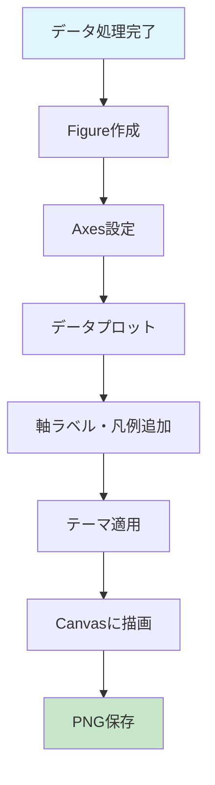

# グラフと可視化 - Graphs and Visualization

このページでは、AATのグラフ表示機能とインタラクティブな可視化機能について説明します。

---

## 📊 グラフの種類

### 1. 重力レベルグラフ (Gravity Level Graph)

CSVファイル読み込み後に表示される基本グラフです。

#### グラフの構成

- **X軸**: 時間（秒）
- **Y軸**: 重力レベル（G単位）
- **青線**: Inner Capsuleの重力レベル
- **赤線**: Drag Shieldの重力レベル（データがある場合）
- **右下**: アプリケーションのバージョン表示（透かし）

#### グラフの特徴

- **高解像度**: Matplotlib使用により、論文品質のグラフを生成
- **テーマ対応**: ダーク/ライトモードに応じて配色が自動調整
- **日本語対応**: 軸ラベルや凡例が日本語で表示

### 2. G-quality評価グラフ

G-quality評価実行時に生成される3つのサブプロットから成るグラフです。

#### サブプロット1: 平均重力レベル vs ウィンドウサイズ

```
Y軸: 平均重力レベル (G)
X軸: ウィンドウサイズ (秒)
```

ウィンドウサイズが大きくなるにつれて、平均値がどう変化するかを確認できます。

#### サブプロット2: 開始時間 vs ウィンドウサイズ

```
Y軸: 開始時間 (秒)
X軸: ウィンドウサイズ (秒)
```

最適な時間窓が実験のどの時点から始まるかを視覚化します。

#### サブプロット3: 標準偏差 vs ウィンドウサイズ

```
Y軸: 標準偏差 (G)
X軸: ウィンドウサイズ (秒)
```

重力レベルの安定性をウィンドウサイズごとに比較できます。

---

## 🖱️ インタラクティブ機能

### 範囲選択（Span Selection）

グラフ上で特定範囲を選択し、その範囲の詳細統計を表示できます。

#### 使用方法

1. **マウスドラッグ**: グラフ上でマウスをドラッグして範囲を選択
2. **視覚的フィードバック**: 選択範囲がハイライト表示
3. **統計ダイアログ**: 選択完了後、統計情報が自動表示

#### 表示される統計情報

##### Inner Capsule

- **平均値 (Mean)**: 選択範囲の平均重力レベル
- **絶対値の平均 (Abs Mean)**: 絶対値の平均
- **標準偏差 (Std Dev)**: データのばらつき
- **最小値 (Min)** / **最大値 (Max)**: 範囲内の最小・最大値
- **範囲 (Range)**: 最大値 - 最小値
- **データ数 (Count)**: サンプル数

##### Drag Shield

Inner Capsuleと同様の統計情報が表示されます（データがある場合）。

#### 技術的詳細

Matplotlibの`SpanSelector`を使用して実装:

```python
from matplotlib.widgets import SpanSelector

span_selector = SpanSelector(
    ax, onselect_callback,
    'horizontal',  # 水平方向の選択
    useblit=True,  # 高速描画
    props=dict(alpha=0.3, facecolor='yellow')  # 視覚的フィードバック
)
```

---

## 🎨 グラフのカスタマイズ

### テーマによる配色変更

AATは3つのテーマをサポートしており、グラフの配色も自動的に調整されます:

#### ダークモード

- 背景色: 暗いグレー (`#1e1e1e`)
- テキスト色: 白 (`#ffffff`)
- グリッド線: 薄いグレー (`#3a3a3a`)

#### ライトモード

- 背景色: 白 (`#ffffff`)
- テキスト色: 黒 (`#000000`)
- グリッド線: 薄いグレー (`#e0e0e0`)

#### システムデフォルト

OSの設定（ライト/ダーク）に自動的に追従します。

### グラフスタイルの設定

以下のスタイルがMatplotlibに適用されます:

```python
# フォント設定
plt.rcParams['font.family'] = ['Hiragino Sans', 'Yu Gothic', 'sans-serif']
plt.rcParams['font.size'] = 10

# グリッド設定
plt.rcParams['axes.grid'] = True
plt.rcParams['grid.alpha'] = 0.3

# 線の太さ
plt.rcParams['lines.linewidth'] = 1.5
```

---

## 📐 グラフの表示モード

### 通常表示モード

デフォルトの表示モードです。フィルタリングされたデータのみを表示します。

- Inner CapsuleとDrag Shieldを別々のY軸で表示
- 時間 = 0 から終了重力レベルに達するまでのデータを表示

### 全体表示モード

メニューバー「表示」→「全体表示」で切り替え可能です。

- フィルタリングされていないすべてのデータを表示
- 実験全体の様子を確認したい場合に便利

### 比較モード

複数のデータセットを同時に表示して比較できます。

#### 有効化方法

1. メニューバー「表示」→「比較モード」をチェック
2. 複数のCSVファイルを読み込む
3. すべてのデータセットが同じグラフ上に表示

#### 表示される内容

- 各データセットが異なる色で表示
- 凡例にファイル名が表示
- すべてのデータセットで同じ時間軸とY軸を共有

---

## 💾 グラフのエクスポート

### 自動保存

データ処理完了後、グラフは自動的にPNG形式で保存されます:

```
results_AAT/graphs/
├── <filename>_gl.png  # 重力レベルグラフ
└── <filename>_gq.png  # G-quality分析グラフ
```

### エクスポート設定

設定ダイアログで以下のパラメータを調整できます:

| パラメータ | 説明 | デフォルト値 |
|-----------|------|-------------|
| `export_figure_width` | 図の幅（インチ） | 10 |
| `export_figure_height` | 図の高さ（インチ） | 6 |
| `export_dpi` | 解像度（DPI） | 300 |

### 高品質エクスポート

論文用の高品質グラフを生成する場合:

```python
# 設定例
{
    "export_figure_width": 12,
    "export_figure_height": 8,
    "export_dpi": 600  # 高解像度
}
```

---

## 🔧 グラフの技術的詳細

### Matplotlibバックエンド

AATは`Qt5Agg`バックエンドを使用しています:

```python
import matplotlib
matplotlib.use('Qt5Agg')

from matplotlib.backends.backend_qt5agg import FigureCanvasQTAgg
from matplotlib.figure import Figure
```

### グラフの描画フロー



### パフォーマンス最適化

#### 1. ダブルバッファリング

`useblit=True`を使用して高速描画:

```python
span_selector = SpanSelector(ax, callback, useblit=True)
```

#### 2. 描画の遅延

大量のデータポイントがある場合、間引いて表示:

```python
if len(data) > 10000:
    step = len(data) // 10000
    data = data[::step]
```

---

## 🎯 グラフの活用例

### 例1: 実験品質の評価

グラフから微小重力環境の品質を視覚的に評価:

```
✅ 良好な例:
- 重力レベルが0G付近で安定
- ノイズが少なく、滑らかな曲線
- Inner CapsuleとDrag Shieldの差が小さい

❌ 改善が必要な例:
- 大きな変動やスパイクが存在
- 重力レベルが0Gから大きく外れている
- Inner CapsuleとDrag Shieldの差が大きい
```

### 例2: 異なる実験条件の比較

比較モードを使用して、複数の実験結果を並べて表示:

```
実験A（青線）: 標準偏差 0.001 G
実験B（赤線）: 標準偏差 0.005 G
→ 実験Aの方が安定した微小重力環境
```

### 例3: 論文用グラフの作成

高解像度設定でエクスポートし、論文に使用:

```
設定:
- DPI: 600
- サイズ: 12 × 8インチ
- フォント: 明朝体（後処理で変更可能）
```

---

## ❓ よくある質問

### Q: グラフが表示されない

**A**: 以下を確認してください:

- データが正しく読み込まれているか
- データに有効な値が含まれているか
- Matplotlibが正しくインストールされているか

### Q: 日本語フォントが文字化けする

**A**: AATは自動的に日本語フォントを設定しますが、環境によっては失敗する場合があります:

- **macOS**: Hiragino Sansが使用されます
- **Windows**: Yu Gothicが使用されます
- **Linux**: Noto Sans CJKのインストールを推奨

### Q: グラフの色を変更したい

**A**: 現在、UIから色を変更する機能はありません。コードを直接編集する必要があります:

```python
# gui/main_window.py 内
ax.plot(time, gravity_inner, color='blue', label='Inner Capsule')
# 'blue'を他の色に変更
```

---

## 🚀 次のステップ

- **[[使い方-Usage]]** - 範囲選択機能の使用方法
- **[[設定-Configuration]]** - グラフエクスポート設定の詳細
- **[[開発者ガイド-Developer-Guide]]** - グラフ機能のカスタマイズ

[[Home]] に戻る
