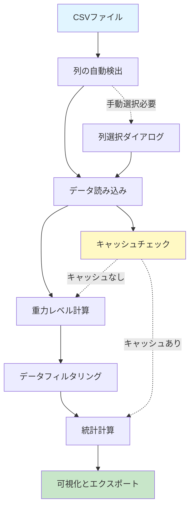

# データ解析パイプライン - Data Analysis Pipeline

このページでは、AATがCSVファイルからデータを処理し、重力レベルを計算するまでの詳細なプロセスを説明します。

---

## 📊 データ処理フロー概要



---

## 🔍 ステップ1: 列の自動検出

### 処理内容

AATは、CSVファイルを読み込む際に時間列と加速度列を自動検出します。UTF-8で読み込めなかった場合は自動でCP932（Shift-JIS）にフォールバックします。

### アルゴリズム

**時間列の検出パターン**:
- `time`, `時間`, `秒`, `s`, `sec`, `t` を含む列名

**加速度列の検出パターン**:
- `acc`, `accel`, `acceleration`, `加速度`, `g` を含む列名

名前で検出できない場合は、数値列を時間候補・加速度候補として補完します。検出に失敗した場合は列選択ダイアログに分岐します。

### 実装（`core/data_processor.py`）

```python
def detect_columns(file_path: str) -> tuple[list, list]:
    \"\"\"CSVファイルから時間列と加速度列の候補を検出する\"\"\"
    try:
        data = pd.read_csv(file_path)
    except UnicodeDecodeError:
        data = pd.read_csv(file_path, encoding="cp932")

    time_columns = [
        column for column in data.columns if any(keyword in column.lower() for keyword in ["time", "時間", "秒", "s", "sec", "t"])
    ]
    acceleration_columns = [
        column for column in data.columns if any(keyword in column.lower() for keyword in ["acc", "加速度", "a", "accel", "acceleration", "g"])
    ]

    # フォールバック: 数値列を候補に追加
    if not time_columns:
        time_columns = [c for c in data.columns if pd.api.types.is_numeric_dtype(data[c])]
    if not acceleration_columns:
        acceleration_columns = [c for c in data.columns if pd.api.types.is_numeric_dtype(data[c]) and c not in time_columns]
    return time_columns, acceleration_columns
```

---

## 📥 ステップ2: データ読み込み

### 処理内容

検出された列、またはユーザーが手動で選択した列を使用してデータを読み込みます。

- **設定の適用**: `config` の `time_column`、`acceleration_column_inner_capsule`、`acceleration_column_drag_shield` で指定された列名を使用します。
- **センサーの有効化/無効化**: `use_inner_acceleration` または `use_drag_acceleration` が `false` の場合、該当するセンサーのデータ読み込みと処理はスキップされます（両方が `false` の場合はエラーとなります）。
- **符号反転**: Inner Capsuleデータは、`invert_inner_acceleration` が `true` の場合、読み込み時に符号が反転されます。

### 同期と時間軸調整

Inner CapsuleとDrag Shieldのデータ同期は以下の手順で行われます（最初に見つかったインデックスを使用）:

1. **同期点の検出**: 加速度の絶対値が `acceleration_threshold` 未満となる最初のサンプルを探索します。
2. **フォールバック**: 同期点が見つからない場合は、データの先頭（インデックス0）を使用します。
3. **相互参照**: Inner側のみ同期点が見つからない場合、Drag側の同期インデックスを代用します。
4. **時間調整**: 共通の時間列から同期インデックスの時間を差し引き、同期点を `t=0` とするように調整します。
5. **G値変換**: 加速度データを `gravity_constant`（デフォルト: 9.797578）で割り、重力レベル（G）に変換します。

### キャッシュシステム

効率的な再処理のため、`use_cache` が有効な場合は `results_AAT/cache/` ディレクトリにキャッシュを作成します。

- **ファイル名**: `<元ファイル名>_<cache_id>.pickle`
- **Cache ID**: ファイルの更新時刻、主要な設定（列名、閾値、バージョンなど）から生成されるハッシュ値。設定やファイル内容が変更されると、自動的に新しいキャッシュが作成されます。
- **生データ**: `raw_data` を保持する必要がある場合のみ、`*_raw.h5` ファイルに別途保存されます。
- **無効化条件**: アプリケーションのバージョン変更や、元ファイルの更新時刻の不一致により、キャッシュは無効とみなされます。

---

## ⚙️ ステップ3: 重力レベル計算

### 計算式

加速度データから重力レベル（G値）を計算します:

```
重力レベル (G) = 加速度 (m/s²) / 重力定数 (m/s²)
```

- **デフォルト重力定数**: `9.797578 m/s²` (設定で変更可能)
- **Inner Capsule加速度の反転**: 設定で有効にすると、符号を反転して計算（デフォルトでON）
- **同期判定の閾値**: `acceleration_threshold`（デフォルト `5.0 m/s²`）未満の最初のサンプルを基準に時間を0合わせ

### 実装例

```python
# 同期点を検索
acceleration_threshold = config.get("acceleration_threshold", 5.0)
sync_indices_drag = np.where(np.abs(acceleration_drag_shield) < acceleration_threshold)[0]
sync_indices_inner = np.where(np.abs(acceleration_inner_capsule) < acceleration_threshold)[0]

# 最初に見つかったインデックスを使用（なければ0）
sync_index_drag = int(sync_indices_drag[0]) if len(sync_indices_drag) > 0 else 0
sync_index_inner = int(sync_indices_inner[0]) if len(sync_indices_inner) > 0 else 0

# Innerが見つからずDragがある場合はDragに合わせる
if len(sync_indices_inner) == 0 and len(sync_indices_drag) > 0:
    sync_index_inner = sync_index_drag

# 0合わせした時間と重力レベル
adjusted_time_inner = time - time.iloc[sync_index_inner]
gravity_level_inner = acceleration_inner_capsule / config["gravity_constant"]

if config.get("invert_inner_acceleration", False):
    gravity_level_inner = -gravity_level_inner
```

---

## 🔧 ステップ4: データフィルタリング

### フィルタリングの目的

実験開始直後の過渡応答や、実験終了後の不要なデータを除外し、微小重力環境の評価に最適なデータ範囲を抽出します。

### フィルタリングアルゴリズム

#### 1. 開始点の検出

- **基本条件**: 時間（調整済み）が `0` 以上となる最初のインデックスを特定します。
- **スキップ処理**: さらに `min_seconds_after_start`（デフォルト0.7秒）で指定された秒数分だけデータをスキップし、安定した微小重力状態が始まると想定される点を開始点とします。

#### 2. 終了点の検出

開始点からデータを順方向にスキャンし、以下の条件を満たす点を終了点とします:

```python
# 重力レベルが終了閾値（デフォルト: 8.0G）以上になった最初のポイント
end_index_inner_candidates = np.where(gravity_level_inner_capsule >= end_gravity_level)[0]
```

#### 3. データのトリミング

特定された開始インデックスから終了インデックスまでの範囲を抽出します:

```python
filtered_time = time[start_idx:end_idx]
filtered_gravity = gravity_level[start_idx:end_idx]
```

### 設定パラメータ

| パラメータ | 説明 | デフォルト値 |
|-----------|------|-------------|
| `end_gravity_level` | 終了判定を行う重力レベル閾値（G） | 8.0 |
| `min_seconds_after_start` | 開始点（t=0）からスキップする秒数 | 0.7 |

---

## 📈 ステップ5: 統計計算

### スライディングウィンドウ分析

指定されたウィンドウサイズで重力レベルデータをスキャンし、最も安定した区間を検出します。

#### アルゴリズム

1. **ウィンドウサイズの決定**:
   ```python
   window_size_samples = window_size (秒) × sampling_rate (Hz)
   ```
   例: 0.1秒 × 1000Hz = 100サンプル

2. **スライディングウィンドウ処理**:
   ```python
   for i in range(len(data) - window_size_samples + 1):
       window = data[i : i + window_size_samples]
       std = np.std(window)  # 標準偏差を計算
       mean = np.mean(np.abs(window))  # 絶対値の平均を計算
   ```

3. **最小標準偏差の検出**:
   ```python
   min_std_index = np.argmin(std_devs)
   best_mean = means[min_std_index]
   best_time = times[min_std_index]
   best_std = std_devs[min_std_index]
   ```

### 出力統計情報

- **平均重力レベル**: 最小標準偏差ウィンドウの絶対値の平均
- **開始時間**: 最小標準偏差ウィンドウの開始時刻
- **標準偏差**: 最小標準偏差の値

---

## 🎯 G-quality評価

フィルタリング済みデータに対して、`g_quality_start` から `g_quality_end` まで `g_quality_step` 間隔でウィンドウサイズを変えながら `calculate_statistics` を繰り返します（デフォルト: 0.1秒〜1.0秒を0.05秒刻みで19ステップ）。データ長が最小ウィンドウサイズ未満の系列はスキップされます。

---

## 💾 ステップ6: 可視化とエクスポート

### グラフ生成

Matplotlibを使用して重力レベルのグラフを生成:

- **X軸**: 時間（秒）
- **Y軸**: 重力レベル（G）
- **Inner Capsule**: 青線
- **Drag Shield**: 赤線（データがある場合）

### Excelエクスポート

`openpyxl`を使用してExcelファイルを生成します。`sampling_rate` から算出したステップで共通時間軸を作り、存在する系列のみ線形補間して書き込みます。`raw_data` が渡された場合のみ、元加速度を "Acceleration Data" シートに追加します。

1. **Gravity Level Data**: 時間と重力レベル
2. **Gravity Level Statistics**: 統計情報
3. **Acceleration Data**: 元の加速度データ（生データ提供時のみ）
4. **G-quality Analysis**: G-quality評価結果（実行時のみ）

### 自動保存

すべての結果は`results_AAT/`ディレクトリに自動保存されます:

```
results_AAT/
├── <filename>.xlsx
├── graphs/
│   └── <filename>_gl.png
└── cache/
    ├── <filename>_<hash>.pickle
    └── <filename>_<hash>_raw.h5
```

---

## 🔄 エラーハンドリング

### データ読み込みエラー

- **`DataLoadError`**: CSVファイルの読み込みに失敗
- **`ColumnNotFoundError`**: 必要な列が見つからない
- **`UnicodeDecodeError`**: エンコーディングエラー（自動フォールバック）

### データ処理エラー

- **`DataProcessingError`**: データ変換や計算中のエラー
- **データ長の不一致**: 時間配列とデータ配列の長さが異なる

### キャッシュエラー

- キャッシュの読み込みに失敗した場合、自動的に再計算
- キャッシュの書き込みに失敗してもデータ処理は継続

---

## 🧪 パフォーマンス最適化

### NumPy配列の活用

Pandas SeriesをNumPy配列に変換して高速化:

```python
gravity_array = np.asarray(gravity_level.values)
time_array = np.asarray(time.values)
```

### 事前割り当て

配列を事前に割り当ててメモリ効率を改善:

```python
num_windows = len(data) - window_size_samples + 1
std_devs = np.empty(num_windows)
means = np.empty(num_windows)
```

### バックグラウンド処理

QThreadを使用してUIの応答性を維持しながらデータ処理を実行。

詳細は **[[開発者ガイド-Developer-Guide]]** をご覧ください。

---

## 🚀 次のステップ

- **[[G-quality評価-G-quality-Evaluation]]** - G-quality評価の詳細
- **[[APIリファレンス-API-Reference]]** - データ処理関数のAPI仕様
- **[[設定-Configuration]]** - 設定パラメータの詳細

[[Home]] に戻る
