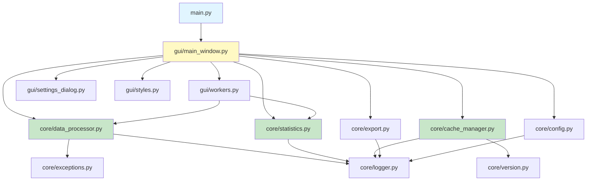

# プロジェクト構造 - Project Structure

このページでは、AATプロジェクトのディレクトリ構成とモジュール構成について説明します。

---

## 📁 ディレクトリ構成

```
AAT/
├── main.py                      # アプリケーションのエントリーポイント
├── pyproject.toml               # プロジェクト設定とビルド設定
├── uv.lock                      # 依存関係のロックファイル
├── README.md                    # プロジェクトのREADME
├── LICENSE.md                   # Apache License 2.0
├── CHANGELOG.md                 # 変更履歴
├── CONTRIBUTING.md              # 貢献ガイド
│
├── core/                        # コアロジック（データ処理・統計・設定）
│   ├── __init__.py
│   ├── data_processor.py        # CSV読み込みと重力レベル計算
│   ├── statistics.py            # 統計計算
│   ├── cache_manager.py         # キャッシュ管理
│   ├── export.py                # Excelエクスポート
│   ├── config.py                # 設定ファイル管理
│   ├── logger.py                # ロギング機能
│   ├── exceptions.py            # カスタム例外
│   ├── paths.py                 # パス管理ユーティリティ
│   └── version.py               # バージョン管理
│
├── gui/                         # GUI層（PySide6ベース）
│   ├── __init__.py
│   ├── main_window.py           # メインウィンドウ（126KB, 核心部分）
│   ├── workers.py               # バックグラウンドワーカー
│   ├── settings_dialog.py       # 設定ダイアログ
│   ├── column_selector_dialog.py # 列選択ダイアログ
│   ├── styles.py                # テーマ・スタイル管理
│   ├── widgets.py               # カスタムウィジェット
│   └── assets/                  # GUI用アセット
│       ├── icons/               # アイコン画像
│       └── ...
│
├── tests/                       # テストスイート
│   ├── conftest.py              # pytest共通設定
│   ├── fixtures/                # テストフィクスチャ
│   ├── gui/test_main_window_smoke.py # main_windowの簡易GUIテスト
│   ├── test_cache_manager.py    # cache_managerのテスト
│   ├── test_config.py           # configのテスト
│   ├── test_data_processor.py   # data_processorのテスト
│   ├── test_exceptions_extended.py # exceptionsのテスト
│   ├── test_export.py           # exportのテスト
│   ├── test_statistics.py       # statisticsのテスト
│   ├── test_version.py          # versionユーティリティのテスト
│   └── test_workers.py          # GQualityWorker等のテスト
│
├── docs/                        # ドキュメント
│   ├── README.md                # ドキュメント目次
│   ├── api-reference.md         # APIリファレンス
│   ├── user-manual.md           # ユーザーマニュアル
│   ├── developer-guide.md       # 開発者ガイド
│   ├── design-specification.md  # 設計仕様書
│   ├── testing-guide.md         # テストガイド
│   └── deployment-guide.md      # デプロイメントガイド
│
├── config/                      # 設定ファイル
│   └── config.default.json      # デフォルト設定
│
├── scripts/                     # ビルド・デプロイスクリプト
│   └── build_mac_app.py         # macOSアプリビルドスクリプト
│
├── resources/                   # リソースファイル
│   └── packaging/               # パッケージング関連
│       ├── icons/               # アプリアイコン
│       │   └── app_icon.png
│       └── dmg/                 # DMG背景画像
│           └── dmg_background.tiff
│
├── build/                       # ビルド出力（.gitignore）
│   ├── dist/                    # 配布用ファイル
│   │   └── AAT.app              # macOSアプリバンドル
│   └── dmg/                     # DMGファイル
│       └── AAT.dmg
│
├── .github/                     # GitHub Actions CI/CD
│   └── workflows/
│       └── ...
│
├── .vscode/                     # VSCode設定
│   └── settings.json
│
└── .pre-commit-config.yaml      # pre-commitフック設定
```

---

## 🧩 モジュール構成

### `core/` - コアモジュール

データ処理とビジネスロジックを担当。GUIに依存しない設計。

#### [`data_processor.py`](../core/data_processor.py)

**責務**: CSVファイルの読み込みと重力レベル計算

主な関数:
- `detect_columns()` - 列の自動検出
- `load_and_process_data()` - データ読み込みと処理
- `filter_data()` - データフィルタリング

#### [`statistics.py`](../core/statistics.py)

**責務**: 統計計算

主な関数:
- `calculate_statistics()` - スライディングウィンドウ統計
- `calculate_range_statistics()` - 範囲選択統計

#### [`cache_manager.py`](../core/cache_manager.py)

**責務**: 処理済みデータのキャッシュ管理

主な関数:
- `generate_cache_id()` - キャッシュID生成
- `save_to_cache()` - キャッシュ保存
- `load_from_cache()` - キャッシュ読み込み
- `has_valid_cache()` - キャッシュ有効性確認

#### [`export.py`](../core/export.py)

**責務**: Excelファイルとグラフの出力

主な関数:
- `export_data()` - 通常データのエクスポート
- `export_g_quality_data()` - G-quality評価結果のエクスポート
- `create_output_directories()` - 出力ディレクトリ作成

#### [`config.py`](../core/config.py)

**責務**: 設定ファイルの読み書き

主な関数:
- `load_config()` - 設定読み込み
- `save_config()` - 設定保存
- `get_user_config_dir()` - ユーザー設定ディレクトリ取得

#### [`exceptions.py`](../core/exceptions.py)

**責務**: カスタム例外定義

主な例外:
- `DataLoadError` - データ読み込みエラー
- `DataProcessingError` - データ処理エラー
- `ColumnNotFoundError` - 列未検出エラー

---

### `gui/` - GUIモジュール

ユーザーインターフェースを担当。PySide6ベース。

#### [`main_window.py`](../gui/main_window.py)

**責務**: メインウィンドウの実装（最大のファイル、約2900行）

主なクラスとメソッド:
- `MainWindow.__init__()` - UI初期化
- `MainWindow._setup_ui()` - UI構築
- `MainWindow._plot_data()` - グラフ描画
- `MainWindow._handle_file_selection()` - ファイル選択処理

#### [`workers.py`](../gui/workers.py)

**責務**: バックグラウンド処理

主なクラス:
- `GQualityWorker` - G-quality評価ワーカー（QThread）

#### [`settings_dialog.py`](../gui/settings_dialog.py)

**責務**: 設定ダイアログ

主なクラス:
- `SettingsDialog` - 設定UI

#### [`column_selector_dialog.py`](../gui/column_selector_dialog.py)

**責務**: 列選択ダイアログ

主なクラス:
- `ColumnSelectorDialog` - 列選択UI

#### [`styles.py`](../gui/styles.py)

**責務**: テーマとスタイル管理

主な関数:
- `apply_theme()` - テーマ適用
- `Colors` - カラーパレット定義

---

## 🔗 モジュール間の依存関係



---

## 🎯 設計原則

### 1. 関心の分離（Separation of Concerns）

- **`core/`**: データ処理ロジック（GUI非依存）
- **`gui/`**: ユーザーインターフェース

### 2. 非同期処理

- `QThread`を使用してバックグラウンド処理を実現
- UIの応答性を維持

### 3. キャッシュ戦略

- 2層キャッシュ（HDF5 + Pickle）
- インテリジェントな無効化

### 4. 設定管理

- JSONベースの柔軟な設定
- OS標準ディレクトリへの保存

---

## 📊 コード統計

| 項目 | 値 |
|------|------|
| **総行数** | 約8,000行（コメント・空行含む）|
| **最大ファイル** | `gui/main_window.py` (2,910行) |
| **Pythonファイル数** | 約20ファイル |
| **テストファイル数** | 7ファイル |
| **テストカバレッジ** | 82% (core: 86%, gui: 74%) |

---

## 🧪 テスト構造

### ユニットテスト

- `tests/test_*.py` - 各モジュールのユニットテスト
- `pytest`フレームワークを使用
- `pytest-cov`でカバレッジ計測

### GUIテスト

- `pytest-qt`を使用したGUIテスト
- メインウィンドウの動作を検証

詳細は **[[テストガイド]]** をご覧ください（既存の`docs/testing-guide.md`を参照）。

---

## 🚀 次のステップ

- **[[APIリファレンス-API-Reference]]** - 各モジュールの詳細API
- **[[開発者ガイド-Developer-Guide]]** - 開発環境のセットアップ
- **[[設定-Configuration]]** - 設定ファイルの詳細
